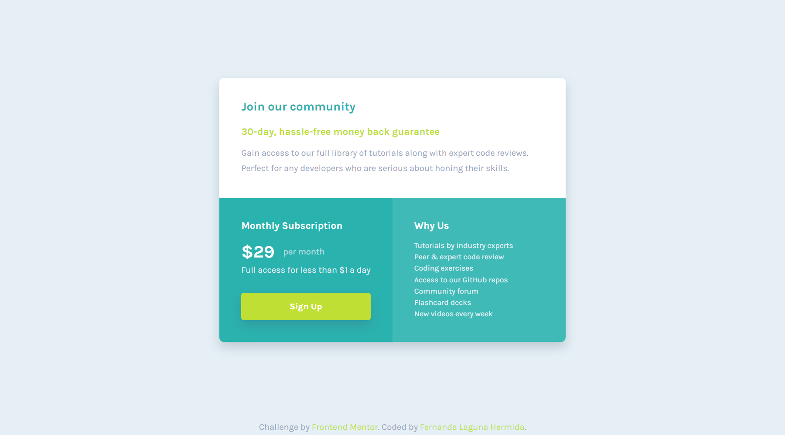

# Frontend Mentor - Single price grid component solution

This is a solution to the [Single price grid component challenge on Frontend Mentor](https://www.frontendmentor.io/challenges/single-price-grid-component-5ce41129d0ff452fec5abbbc). Frontend Mentor challenges help you improve your coding skills by building realistic projects. 

## Table of contents

- [Overview](#overview)
  - [The challenge](#the-challenge)
  - [Screenshot](#screenshot)
  - [Links](#links)
- [My process](#my-process)
  - [Built with](#built-with)
  - [What I learned](#what-i-learned)
  - [Continued development](#continued-development)
  - [Useful resources](#useful-resources)
- [Author](#author)

## Overview

### The challenge

Users should be able to:

- View the optimal layout for the component depending on their device's screen size
- See a hover state on desktop for the Sign Up call-to-action

### Screenshot




### Links

- Solution URL: https://www.frontendmentor.io/solutions/responsive-component-using-grid-and-flexbox-small-animation-dWzvFeuzyR
- Live Site URL: https://ferlagher.github.io/FMC-Single-price-grid

## My process

### Built with

- Semantic HTML5 markup
- Sass <3
- Flexbox
- CSS Grid

### What I learned

Today I leanred that `box-shadow` it's a great property to make cool effects!

```scss
&:hover { //cool accordion transition
    transform: translateY(-15px);
    box-shadow: 0 10px 0 -4px #c0df3460,
        0 20px 0 -8px #c0df3460,
        0 16px 10px #c0df3460;
}
```

### Continued development

Transitions and animations are the funniest things to make in css. I'll continue adding them to future challenges!

## Author

- LinkedIn - [ferlagher](https://www.linkedin.com/in/ferlagher/)
- Frontend Mentor - [@ferlagher](https://www.frontendmentor.io/profile/ferlagher)
- Instagram - [@ferlagher](https://www.instagram.com/ferlagher/)

Thank you very much for reading. ♥
